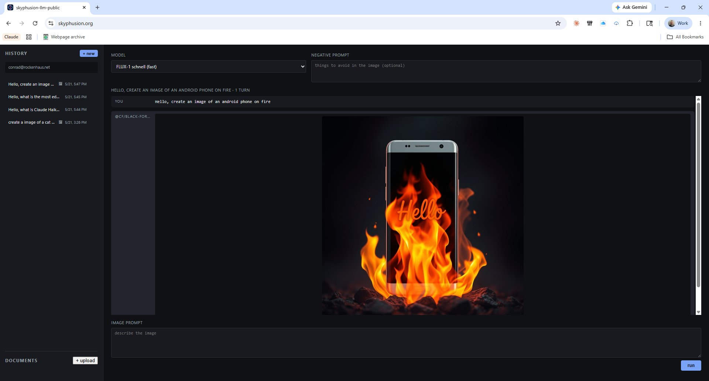

# skyphusion-llm-public

[](LICENSE)
[](https://github.com/SkyPhusion/skyphusion-llm-public/actions/workflows/typecheck.yml)

A multimodal AI playground deployed as a single Cloudflare Worker. 37 chat models across 5 providers, image / TTS / STT / video / music generation, RAG over PDF and XLSX, projects that scope a knowledge base and system prompt, Discord chat-log ingestion, opt-in web search via Tavily and Wikipedia, SSE streaming on supported chat models, and multi-turn conversations. One web UI behind Cloudflare Access, per-user history, R2 for all binary artifacts.

<p align="center">
  <br><br>
  
</p>

## What this is

A working template for the Cloudflare AI stack. One Worker, no framework, no build step beyond TypeScript. The interesting parts are the patterns, not the model count:

- **Unified `env.AI.run()` binding** drives every modality through one call surface: chat, vision input, image gen, TTS, STT, video gen (Unified Billing), and music gen.
- **BYOK paths** for Anthropic Claude, xAI Grok, and Amazon Bedrock (Nova family plus TwelveLabs Pegasus 1.2). Each provider has its own dispatch helper that transforms our internal `messages` shape into the provider's format.
- **SSE streaming** (v0.13.0+) for chat models on all four providers: Anthropic native SSE, Workers AI OpenAI-compatible SSE, xAI OpenAI-compatible SSE, and Bedrock Nova `vnd.amazon.eventstream` binary frames. Pegasus stays single-shot.
- **AI Gateway** wraps every call for observability, caching, and rate-limiting.
- **D1** holds chat metadata, multi-turn conversation history, and RAG chunk text. **R2** holds all binary artifacts. **Vectorize** holds RAG embeddings (768-dim BGE-base). The chat row references R2 keys; nothing binary touches D1.
- **Cloudflare Workflows** owns long-running Unified Billing video and music generation (30s to 3min jobs). The `LongRunWorkflow` class holds the blocking `env.AI.run` call alive across step boundaries that `ctx.waitUntil` cannot.
- **Cloudflare Access** gates the entire worker URL. The worker reads `Cf-Access-Authenticated-User-Email` to scope history per user; R2 objects carry `customMetadata.user_email` so cross-user access is impossible even if a UUID is guessed.
- **Client-side video keyframe extraction** sends 8 evenly-spaced frames to vision-capable chat models instead of uploading the full video file. The exception is TwelveLabs Pegasus 1.2 on Bedrock, which takes the raw video file directly for proper temporal understanding (18MB cap per the Bedrock InvokeModel request limit).
- **Collapsible model picker** (v0.15.0) groups the ~50 catalog entries across 6 modalities with capability badges (vision, stream) inline.

## Features

**Chat (37 models across 5 providers; 32 stream-capable):**
- Workers AI: Llama 4 Scout, Llama 3.x family, Qwen3 30B / QwQ 32B / Qwen2.5 Coder 32B, DeepSeek R1, Mistral Small 3.1, Gemma 4 26B / Gemma 3 12B, Granite 4 Micro, Nemotron 3 120B, GLM-4.7 Flash, Hermes 2 Pro, GPT-OSS 120B / 20B, Kimi K2.6
- Anthropic BYOK: Opus 4.8, Opus 4.7, Opus 4.6, Sonnet 4.6, Haiku 4.5 (all streaming)
- xAI BYOK: Grok 4.3, Grok 4.20 (Multi-Agent and Reasoning), Grok Build 0.1 (all streaming as of v0.16.0)
- Bedrock BYOK: Nova 2 Lite/Pro, Nova Lite/Pro (all streaming as of v0.16.0), TwelveLabs Pegasus 1.2 (single-shot video Q&A)
- OpenAI (Unified Billing): GPT-5.5, GPT-5.4, GPT-5.4 mini, o4-mini (non-streaming; needs CF credits)

**Image generation:** FLUX 2 Klein 9B/4B, FLUX 2 Dev, FLUX-1 schnell, Lucid Origin, Phoenix 1.0, Dreamshaper 8 LCM. FLUX.2 models accept up to 4 reference images (v0.16.0) for image-to-image generation, downscaled client-side to 512px.

**Video generation:** Google Veo 3.1 / 3.1 Fast / 3 / 3 Fast (Unified Billing), ByteDance Seedance 2.0 / 2.0 Fast, MiniMax Hailuo 2.3 / 2.3 Fast, RunwayML Gen-4.5, Alibaba HappyHorse 1.0, PixVerse v6 / v5.6, Vidu Q3 Pro / Q3 Turbo, xAI Grok Imagine Video. BYOK for xAI, Unified Billing for the rest (durable via Cloudflare Workflows).

**Music generation:** MiniMax Music 2.6 (Unified Billing, durable via Workflows).

**Text-to-speech:** Aura-2 EN / ES, MeloTTS.

**Speech-to-text:** Whisper Large v3 Turbo / Whisper / Whisper Tiny EN.

**RAG (Vectorize):** upload `.txt`, `.md`, `.pdf`, or `.xlsx`/`.xls` files via the sidebar. The worker chunks, embeds via BGE-base, and stores vectors in Vectorize plus text in D1. Per-page metadata for PDFs, per-sheet for XLSX. Toggle "use my docs" per turn to fold the top-5 nearest chunks into the system prompt before the LLM call.

**Projects and knowledge stores (v0.20.0+):** group documents and conversations under a named project with its own default system prompt and retrieval scope. A document can belong to multiple projects; selecting a project scopes "use my docs" retrieval to just that project's documents and applies the project's system prompt as the default for new chats. Conversations started while a project is active are tagged with it, and any conversation can be moved between projects from the sidebar. See [Projects and knowledge stores](#projects-and-knowledge-stores) below.

**Discord ingestion (v0.20.3+):** import a [DiscordChatExporter](https://github.com/Tyrrrz/DiscordChatExporter) JSON export into a project. The worker parses the export, groups messages into conversation-aware chunks (by author, time gap, and channel), and embeds them into the project's retrieval scope, so you can ask questions across an archived Discord channel's history. Import is a file picker in the project's "manage documents" modal.

**Web search (v0.17.0):** opt-in retrieval source that queries Tavily (general web) and Wikipedia (reference and lore) in parallel. Snippets folded into the system prompt the same way RAG chunks are. Per-turn toggle. Tavily requires `TAVILY_API_KEY`; Wikipedia needs no setup. See [Web search](#web-search) below.

**Streaming (v0.13.0+):** `POST /api/chat/stream` returns SSE for any chat model flagged `streaming: true` in the catalog. Token deltas surface as `{ type: "delta", text: "..." }` events, terminal completion as `{ type: "done", ... }` with token counts and conversation IDs. Client disconnect aborts the upstream model call immediately.

**Multi-turn conversations:** `conversation_id` plus `turn_index` on chat rows. Continuing a conversation pulls prior turns and assembles a full message history for the next call. Mixed-model conversations allowed (start with Llama, continue with Claude). Text-only on continuation; prior images, audio, and video are not re-sent.

**UI:** collapsible model picker with per-modality groups and capability badges (v0.15.0), capability-aware mode switching (vision-only attachment types; image-mode UI re-skin to "negative prompt"; TTS / STT / video / music hide irrelevant inputs), FLUX.2 reference image attach UI (v0.16.0), per-turn web-search toggle (v0.17.0), per-user replay-able history with attachments and generated artifacts, Enter to send / Shift+Enter for newline.

**Auth:** Cloudflare Access on the worker URL. Per-user history and R2 ownership checks via `Cf-Access-Authenticated-User-Email`. Free up to 50 seats on Zero Trust.

## Stack

- One Worker, TypeScript, no framework
- `env.AI` unified binding routed through Cloudflare AI Gateway
- D1 for chat history rows, multi-turn conversations, and RAG chunk text
- R2 for input and output artifact bytes
- Vectorize for RAG embeddings (768-dim, cosine)
- Cloudflare Workflows for long-running Unified Billing video and music generation
- Static frontend served via Workers Assets
- Cloudflare Access in front for auth

Roughly 3700 LOC TypeScript in `src/index.ts` plus ~1900 LOC across the extracted modules (`src/providers/`, `src/parsers/`, `src/discord.ts`, `chunking.ts`, and friends), plus ~3900 LOC vanilla JS / CSS / HTML in `public/`, plus schema.sql.

## Quickstart

Prerequisites:

- Cloudflare account with Workers, D1, R2, AI Gateway, and Workers AI enabled
- Node.js 18 or later
- Workers Paid plan if you plan to exceed the free Workers AI tier (10,000 neurons per day across all model usage), and required as of v0.11.0 for the `unpdf` bundle size

```
git clone https://github.com/SkyPhusion/skyphusion-llm-public.git
cd skyphusion-llm-public
npm install
npm run bootstrap
```

`npm run bootstrap` copies `wrangler.example.toml` (the committed template) to `wrangler.toml` (your per-deployer config; gitignored). The committed template gains new bindings across versions; your `wrangler.toml` keeps your deployer-specific IDs across pulls. See [Upgrading across versions](#upgrading-across-versions) below for the convention.

### 1. Create the AI Gateway

Dashboard > AI > AI Gateway > Create Gateway. Name it anything. Copy the slug from the URL after creation. Then set it as a worker secret:

```
echo "your-gateway-slug" | npx wrangler secret put GATEWAY_ID
```

For local development, also add it to `.dev.vars` so `wrangler dev` picks it up:

```
echo "GATEWAY_ID=your-gateway-slug" >> .dev.vars
```

`.dev.vars` is gitignored.

### 2. Create the D1 database

```
npm run db:create
```

Paste the returned `database_id` into `wrangler.toml` at `[[d1_databases]] database_id`. Then apply the schema:

```
npm run db:migrate:remote
npm run db:migrate:local
```

### 3. Create the R2 bucket

```
npx wrangler r2 bucket create skyphusion-llm-public
```

No further config needed; the binding is already in `wrangler.example.toml` (and therefore in your `wrangler.toml` after bootstrap).

### 4. Create the Vectorize index

For RAG over PDFs and spreadsheets:

```
npx wrangler vectorize create skyphusion-llm-vec --dimensions=768 --metric=cosine
```

The `VEC` binding is already in the template. If you don't intend to use RAG, the worker still functions; the binding just goes unused.

### 5. First deploy

```
npm run deploy
```

You will get a `*.workers.dev` URL.

### 6. Cloudflare Access

Dashboard > Zero Trust > Access > Applications > Add an application > Self-hosted. Application domain is your worker URL. Identity providers: enable at least one (Google, GitHub, One-Time PIN, etc.). Policy: Action Allow, Rules > Emails > include your address and anyone else who should have access.

Cloudflare Zero Trust is free up to 50 seats, so a small team is free.

After this, hitting the worker URL shows the Access login screen. Authenticated requests reach the worker with `Cf-Access-Authenticated-User-Email`, which scopes both history and R2 artifact access per user.

### 7. Optional: web search (Tavily)

For the v0.17.0 web-search feature, set a Tavily API key (free tier: 1000 searches/month):

```
npx wrangler secret put TAVILY_API_KEY
```

Without this, the "search the web" toggle still works but falls back to Wikipedia only. See [Web search](#web-search) below.

### 8. Local development

`wrangler dev` does not run Cloudflare Access. The worker falls back to `user_email = 'anonymous'` for local runs. Do not expose your local dev port to the public internet.

```
npm run dev
```

## Upgrading across versions

`wrangler.toml` is gitignored from v0.12.0 on. The repo ships `wrangler.example.toml` as the canonical template. When you pull a new release, your `wrangler.toml` is untouched, but the example template may have gained new bindings (e.g., v0.12.0 added `[[workflows]]` and `[observability]`). To apply those:

```
diff wrangler.toml wrangler.example.toml
```

Each version that touches `wrangler.example.toml` documents the exact TOML blocks to paste in the corresponding [CHANGELOG.md](CHANGELOG.md) entry under a "wrangler.toml migration" heading. Apply those blocks to your local `wrangler.toml` and redeploy.

For D1 **schema** changes, see [Migrating an existing deployment](#migrating-an-existing-deployment). The short version: `schema.sql` is for fresh databases only; upgrade an existing database with the per-version deltas, never by re-running `schema.sql`.

## Architecture

```
                  Browser (Cloudflare Access login)
                              |
                              v
                  Worker (single fetch handler)
        /        |       |        |       |          \
       AI       D1      R2     Vectorize Workflows  ASSETS
   (Gateway) (metadata)(bytes)  (RAG)   (long jobs) (static)
       |
   +---+---+
   |       |
 Tavily  Wikipedia    (web search, v0.17.0)
```

The worker is the only public surface. R2 is private; the worker streams objects through `GET /api/artifact/*` after verifying ownership via `customMetadata.user_email` on the R2 object.

### Routes

| Method | Path | Purpose |
|---|---|---|
| GET    | `/api/models`             | List available models with capability flags (`streaming`, `vision`, `group`) |
| POST   | `/api/chat`               | Run a model. Dispatches by model type. |
| POST   | `/api/chat/stream`        | SSE streaming variant for chat models flagged `streaming: true` |
| GET    | `/api/conversations`      | List the caller's conversations (grouped by `conversation_id`, includes each conversation's `project_id`) |
| GET    | `/api/conversations/:id`  | Full transcript for a conversation |
| DELETE | `/api/conversations/:id`  | Cascade delete of all turns plus R2 artifacts |
| PATCH  | `/api/conversations/:id/project` | Move a conversation to a project, or clear it (`{project_id: number \| null}`) |
| GET    | `/api/history/:id`        | One chat row with full attachment + output references |
| DELETE | `/api/history/:id`        | Delete a single chat row and clean up its R2 objects |
| GET    | `/api/job/:id`            | Poll an async video / music generation job's status |
| GET    | `/api/documents`          | List uploaded RAG documents (optional `?project_id=N` filter) |
| POST   | `/api/documents`          | Upload, chunk, embed, and store a doc |
| GET    | `/api/documents/:id`      | Document metadata plus first chunks preview |
| DELETE | `/api/documents/:id`      | Cascade delete of doc, chunks, vectors, memberships, and original R2 file |
| GET    | `/api/projects`           | List the caller's projects with document counts |
| POST   | `/api/projects`           | Create a project (`{name, description?, system_prompt?}`) |
| GET    | `/api/projects/:id`       | Project metadata plus its attached documents |
| PATCH  | `/api/projects/:id`       | Update name / description / system prompt |
| DELETE | `/api/projects/:id`       | Delete a project; its documents are kept |
| POST   | `/api/projects/:pid/documents/:did` | Attach a document to a project |
| DELETE | `/api/projects/:pid/documents/:did` | Detach a document from a project |
| POST   | `/api/projects/:id/import-discord` | Import a DiscordChatExporter JSON export into a project |
| GET    | `/api/artifact/*`         | Stream an R2 object, gated by ownership |

### Model types

- `chat`: text generation. Accepts vision attachments on vision-capable models. Audio attachments are transcribed via Whisper. Video attachments are 8 client-extracted keyframes.
- `image`: text-to-image generation. The system prompt field becomes the negative prompt. FLUX.2 models additionally accept up to 4 reference images (v0.16.0). Output is a JPEG/PNG in R2.
- `tts`: text-to-speech. Output is audio (MP3 or model-default container) in R2.
- `stt`: speech-to-text transcription. Input audio, output text.
- `video`: text-to-video generation. Long-running (30s-3min); see "Long-running jobs" below.
- `music`: text-to-music generation. Long-running (30s-90s); see "Long-running jobs" below.

### Long-running jobs

Video and music generation can take 1-3 minutes per call, which exceeds the ~30-second post-response budget that Cloudflare Workers gives to `ctx.waitUntil`. Two architectures handle this:

**BYOK video** (xAI Grok Imagine Video) uses submit-and-poll: the worker submits the job synchronously (one fast HTTP call), persists the upstream job ID, and returns immediately. Each client poll of `/api/job/:id` triggers ONE fresh worker invocation that checks upstream status; when done, that invocation downloads to R2 and finalizes D1.

**Unified Billing video and music** (Veo/Seedance/Hailuo/Gen-4.5/HappyHorse/PixVerse/Vidu/MiniMax Music via Cloudflare credits) uses [Cloudflare Workflows](https://developers.cloudflare.com/workflows/). The `LongRunWorkflow` class (defined at the bottom of `src/index.ts`) holds the blocking `env.AI.run` call alive across step boundaries and retries each phase independently. Workflow instance IDs are stored on the chats row as `job_id` for traceability.

The `[[workflows]]` binding in `wrangler.toml` declares this. Two operational notes:

- Workflows are not supported in `wrangler dev --remote`. Local dev mode is fine; deploy to test the Unified Billing video and music paths.
- To inspect a stuck job: `npx wrangler workflows instances describe skyphusion-longrun <job_id>` shows the per-step status, retry count, and any error messages.

## Multimodal handling

**Images.** Native `image_url` content blocks to vision-capable chat models. Downscaled to 1280px max dimension client-side. 4 MB raw cap. FLUX.2 reference images (image-gen, not chat) use a separate 512px max-dim path.

**Audio.** Transcribed via `@cf/openai/whisper-large-v3-turbo` before the model call. Transcript text is prepended to the user message. Raw audio is dropped (not stored). 20 MB cap.

**Video.** Client-side keyframe extraction via HTML5 video + canvas. Eight evenly-spaced frames are pulled at upload time and sent as image content blocks to a vision-capable chat model. The original video file is never uploaded to the worker. This is sampled-frames understanding, not true temporal video reasoning. For raw video understanding, use TwelveLabs Pegasus 1.2 on Bedrock (full file upload, 18MB cap). 100 MB cap on regular video uploads is a browser-side sanity limit.

## Storage and cost

D1 holds metadata and structured JSON pointing to R2 keys. R2 holds binary bytes. Each R2 object carries `customMetadata.user_email` for ownership checks. `DELETE /api/history/:id` cleans up the corresponding R2 objects best-effort.

Workers AI billing is per-token / per-image / per-minute depending on model. Free tier is 10,000 neurons per day across all Workers AI usage. Image generation burns through neurons faster (roughly 1,600 to 6,400 per image). Beyond the free tier, the Workers Paid plan is required at $5/month, with usage at $0.011 per 1,000 neurons.

D1 is roughly $0.75/GB-month for storage. R2 is roughly $0.015/GB-month with no egress fees inside Cloudflare. Free tiers on D1 and R2 cover small personal use indefinitely.

Anthropic (Claude) and xAI (Grok) models bill against your own provider accounts via BYOK, not Cloudflare. Amazon Bedrock models (Nova family, Pegasus 1.2) bill against your AWS account. Tavily web search bills against your Tavily account (1000 searches/month free tier). See per-provider sections below.

## Anthropic models (BYOK)

The Anthropic entries in the model menu (Claude Opus 4.8, Opus 4.7, Opus 4.6, Sonnet 4.6, Haiku 4.5) are routed via BYOK (Bring Your Own Key) rather than Cloudflare Unified Billing. The `env.AI.run()` binding doesn't support BYOK for third-party models, so the worker hits the AI Gateway's Anthropic provider endpoint directly with Anthropic-native payloads. The gateway still wraps the call for observability, caching, and rate-limiting.

All five Claude entries support SSE streaming (v0.13.0). Streaming events normalize to the same envelope as Workers AI/xAI/Bedrock streams, so the client doesn't see Anthropic's native event vocabulary.

There are two ways to authenticate, and the worker supports both:

### Option A (recommended): Store the key in AI Gateway

1. Get an API key from https://console.anthropic.com > Settings > API Keys > Create Key
2. Dashboard > AI > AI Gateway > select your gateway > Provider Keys > Add API Key > pick Anthropic > paste
3. Redeploy: `npm run deploy`

The worker sends the request without an `x-api-key` header; the gateway injects the stored key before forwarding to Anthropic. Keys live in Cloudflare Secrets Store, are rotatable in one place, and never appear in worker secrets.

### Option B: Inline secret

1. Get the key as above
2. Load it as a Worker secret:
   ```
   npx wrangler secret put ANTHROPIC_API_KEY
   ```
3. Redeploy

The worker sends the key as `x-api-key` on every request. This overrides any stored key at the gateway level.

### Authenticated Gateway

If your gateway has Authenticated Gateway enabled (recommended for production), also set:
```
npx wrangler secret put CF_AIG_TOKEN
```
The worker will include the `cf-aig-authorization` header automatically when this is set.

Billing: Anthropic charges your account at their per-token rates. There's no Cloudflare markup on BYOK calls; the gateway just proxies. Caching at the gateway level can reduce duplicate-prompt costs.

## xAI / Grok models (BYOK)

Grok 4.3, Grok 4.20 (Multi-Agent and Reasoning variants), and Grok Build 0.1 are routed via BYOK against your own xAI account. Same patterns as Anthropic above: stored keys in the gateway dashboard (recommended) or inline Worker secret. xAI is OpenAI-compatible so no message transform is needed.

All four Grok entries support SSE streaming as of v0.16.0. The streaming path requests `stream_options.include_usage: true` so token counts arrive in the final pre-`[DONE]` frame.

### Option A (recommended): Store the key in AI Gateway

1. Get an API key from https://console.x.ai > API Keys > Create API Key
2. Dashboard > AI > AI Gateway > Provider Keys > Add API Key > pick xAI > paste
3. Redeploy

### Option B: Inline secret

```
npx wrangler secret put XAI_API_KEY
npm run deploy
```

The same `CF_AIG_TOKEN` secret applies if your gateway is authenticated.

Note: Grok 4.x are reasoning models and expect `max_completion_tokens` rather than the legacy `max_tokens` field. The worker handles this internally. If you swap in older Grok variants (the grok-3 family was retired May 15, 2026), check xAI's docs for which field they expect.

Billing: xAI charges your account directly. Pricing as of mid-2026: Grok 4.3 and Grok 4.20 variants at $1.25/$2.50 per million input/output tokens, Grok Build 0.1 at $1.00/$2.00. No Cloudflare markup.

## Amazon Bedrock models (BYOK)

v0.11.0 adds Bedrock support via AWS SigV4 signing using the `aws4fetch` library. Two model families are wired up:

**Nova (Amazon's chat models)**: Nova 2 Lite, Nova 2 Pro, Nova Lite, Nova Pro. All routed through Bedrock's Converse API, which normalizes request/response shapes across model families. All four Nova entries support SSE streaming as of v0.16.0, using Bedrock's `ConverseStream` endpoint and the `vnd.amazon.eventstream` binary framing protocol (parser lives in `callBedrockNovaStream`).

**Pegasus 1.2 (TwelveLabs video-Q&A)**: Single-shot video understanding. Takes a video file + prompt, returns text analysis. Uses Bedrock's `InvokeModel` endpoint with a video-specific request body. Does NOT stream; the model produces one complete analysis per call.

### Setup

```
npx wrangler secret put AWS_ACCESS_KEY_ID
npx wrangler secret put AWS_SECRET_ACCESS_KEY
```

Optionally set `AWS_REGION` (defaults to `us-east-1`) and `AWS_REGION_PEGASUS` (defaults to `us-west-2`, since Pegasus has tighter regional availability than Nova):

```
npx wrangler secret put AWS_REGION
npx wrangler secret put AWS_REGION_PEGASUS
```

### IAM scoping (recommended)

Create an IAM user with only Bedrock invoke permissions. Attach a policy like:

```json
{
  "Version": "2012-10-17",
  "Statement": [{
    "Effect": "Allow",
    "Action": [
      "bedrock:InvokeModel",
      "bedrock:InvokeModelWithResponseStream"
    ],
    "Resource": "*"
  }]
}
```

The user must also have model access requested and approved in the Bedrock console (Console → Bedrock → Model access → Manage model access). Without explicit access, every invoke returns `AccessDeniedException`.

### Pegasus regional limits

Pegasus 1.2 is only generally available in `us-west-2` and `eu-west-1`. Cross-region inference from other US/EU regions can work but may add latency. If your Nova workloads run in `us-east-1` but you also want Pegasus, set `AWS_REGION=us-east-1` for Nova and `AWS_REGION_PEGASUS=us-west-2` for Pegasus.

### Pegasus video size limit

Bedrock's `InvokeModel` endpoint has a 25MB request payload limit. After base64 encoding, that's about 18MB of binary video. The frontend caps Pegasus uploads at 18MB and returns a clear error for larger files. To support bigger videos you'd integrate S3 (Pegasus accepts `s3Location` in `mediaSource` as an alternative to base64). Not implemented in this build.

### Pegasus in multi-turn conversations

Pegasus is fundamentally single-shot: one video + one prompt per call. If you continue a Pegasus conversation past the first turn, you must re-attach the video on each follow-up turn. The frontend will accept the upload but the worker won't reuse the prior turn's video from R2 automatically. A future iteration may auto-attach the prior turn's video on continuation.

### Billing

AWS charges your account directly per https://aws.amazon.com/bedrock/pricing/. Nova family is competitively priced (Nova 2 Lite is the cheapest at fractions of a cent per 1k tokens); Pegasus pricing is per-second of analyzed video duration.

## OpenAI models (Unified Billing)

GPT-5.5, GPT-5.4, GPT-5.4 mini, and o4-mini (a reasoning model) are routed through Cloudflare Unified Billing, not BYOK. Unlike the Anthropic/xAI/Bedrock chat providers, there is no OpenAI dispatch helper and no `OPENAI_API_KEY` secret: these models ride the generic `env.AI.run("openai/<model>", { messages })` path, the same call surface as the Workers AI hosted chat models, and Cloudflare handles auth and billing against your CF credits.

This is a deliberate re-introduction. OpenAI chat shipped as BYOK in v0.11.0 and was removed in the v0.14.0 consolidation that dropped all non-Anthropic/xAI/Bedrock BYOK paths in favor of Unified Billing. These entries come back on the Unified Billing side of that same decision, so they are not a revert of v0.14.0; the BYOK path stays gone.

Two current limitations:

- **Non-streaming.** The entries are not stream-capable. The streaming gate returns `501` for provider `openai` because there is no OpenAI SSE parser yet; use `POST /api/chat` (non-streaming), which is what the model picker selects for them automatically.
- **Text in / text out.** `capabilities` is empty, so the attach affordance stays off. Multimodal input through the proxied binding is unverified.

Like all Unified Billing models, these appear in the menu but will fail until you enable Unified Billing in the AI Gateway dashboard and fund it with credits. Output and token-usage parsing is handled by `extractOutput`/`extractUsage` in `src/output-extract.ts`, which cover both the OpenAI chat-completions (`{choices[]}`) and Responses API (`{output[]}`) shapes.

## Video generation (dual-route: Unified Billing + BYOK)

Video models have two possible routes through the AI Gateway:

**Route A: Unified Billing via `env.AI.run`** (binding-based, 14 of 15 models). Cloudflare manages provider auth and bills your CF account directly. Requires opting into Unified Billing in the AI Gateway dashboard and funding it with credits. Per CF docs: BYOK is **not** supported for third-party models called through the AI binding.

**Route B: BYOK via per-provider AI Gateway endpoints** (1 of 15 models). Hits `/grok/v1/videos/*` directly with your stored xAI key. Works today without Unified Billing.

This deployment supports both. The router picks per-model based on a `byok_alias` field in the model catalog. If a model has `byok_alias` set and the provider is `xai`, the worker uses BYOK. Otherwise it uses `env.AI.run`, which will fail with code `2021: Invalid User Credentials` until Unified Billing is enabled.

### Model availability matrix

| Model | Route | Works today | Notes |
|---|---|---|---|
| `xai/grok-imagine-video` | BYOK | yes (with XAI_API_KEY) | $0.05/sec, 8s default |
| `google/veo-3.1`, `veo-3.1-fast`, `veo-3`, `veo-3-fast` | Unified | needs CF credits | route through `env.AI.run` |
| `bytedance/seedance-2.0`, `seedance-2.0-fast` | Unified | needs CF credits | CF partner, no public API |
| `minimax/hailuo-2.3`, `hailuo-2.3-fast` | Unified | needs CF credits | CF partner, no public API |
| `runwayml/gen-4.5` | Unified | needs CF credits | CF partner |
| `alibaba/hh1-t2v` | Unified | needs CF credits | image-to-video only |
| `pixverse/v6`, `v5.6` | Unified | needs CF credits | CF partner |
| `vidu/q3-pro`, `q3-turbo` | Unified | needs CF credits | CF partner |

The "needs CF credits" entries appear in the menu but will fail until you enable Unified Billing.

### Enabling Unified Billing

1. https://dash.cloudflare.com -> AI -> AI Gateway -> your gateway -> Settings
2. Find the Unified Billing section (open beta as of November 2025)
3. Enable it and purchase credits ($20 covers ~40-50 video gens depending on model)
4. No code change required; the existing `env.AI.run` path activates automatically once credits are available

### Architecture

Unified Billing video and music run through Cloudflare Workflows (v0.12.0+). The `LongRunWorkflow` class invokes the model, downloads the artifact, uploads to R2, and finalizes the D1 row across independently-retryable steps. BYOK video (xAI) uses a separate submit-and-poll pattern with no workflow involvement (the upstream xAI API is async-natively).

1. Client POSTs to `/api/chat` with a video model. Worker writes a `status='pending'` row to D1 and returns immediately with `{ id, status: "pending", job_id }`.
2. Background work:
   - **Unified route:** Workflow instance starts; the `LongRunWorkflow` class blocks on `env.AI.run("provider/model", ...)` until the video is ready, then downloads and re-hosts.
   - **BYOK route:** worker submits to `api.x.ai/v1/videos/generations`, persists the upstream job ID, and returns. Each client poll triggers a fresh worker invocation that checks upstream status.
3. When complete, the worker (Unified) or job-poll handler (BYOK) uploads video bytes to your R2 bucket and updates the D1 row to `status='done'`.
4. Client polls `GET /api/job/:id` every 5 seconds. For Unified, this endpoint reads D1 only (no provider calls). For BYOK, each poll triggers an upstream status check.
5. Frontend renders `<video controls>` pointing at `/api/artifact/:key` once `status='done'`.

If the job fails at any stage, the row gets `status='failed'` with a descriptive `job_error`. The history list shows a warning icon and the chat detail view shows the error message.

### Defaults

The worker submits with `duration: 8s`, `aspect_ratio: "16:9"`, `resolution: "720p"`, `generate_audio: true` for the Unified route. The BYOK route uses the xAI-specific param shape (`duration: 8` integer). Per-model parameter customization is a backlog item; param-shape iteration for individual partners as each is exercised in production.

### Cost discipline

Video gen is the most expensive feature in this playground.

- The worker has no per-user rate limiting. If you make the URL public, add rate limits at the AI Gateway level.
- Each generation creates an R2 object (~5-30MB per 8s clip). Use `DELETE /api/history/:id` or `DELETE /api/conversations/:id` to clean up.
- BYOK route prices: xAI Grok Imagine Video $0.05/sec ($0.40 per 8s clip).
- Unified Billing prices: visible at https://dash.cloudflare.com under AI > Models > [model] > Pricing. CF marks up upstream provider costs.

### Image-to-video (BYOK only)

The xAI BYOK route exposes an `image_input` parameter for image-to-video on supported models. The UI does not yet expose this in the standard composer; you can wire it in via the worker request body manually if needed. The Alibaba HH1 model is image-to-video only and requires an input image; selecting it without one will fail.

## Speech-to-text (Whisper, standalone)

Attach an audio file, pick a Whisper model, click Run. The worker calls Whisper directly via `env.AI.run` (no async; Whisper completes in seconds) and stores the transcript as the chat's `output` text. The audio's bytes are not persisted; only the transcript is kept on the row's attachment record, same convention as the chat-path audio attachments.

Three Whisper variants are exposed:
- `@cf/openai/whisper-large-v3-turbo` (default; best quality, multilingual)
- `@cf/openai/whisper` (general purpose, slightly older)
- `@cf/openai/whisper-tiny-en` (fast, English-only, beta)

Whisper is hosted on Workers AI (no Unified Billing needed).

## Music generation (MiniMax Music 2.6)

Same Workflow-based architecture as Unified Billing video gen, single model in the catalog: `minimax/music-2.6`. Generates full songs with vocals from a style/mood prompt and optional lyrics, or instrumental tracks. Output is an MP3 stored in R2.

Input fields:
- `user_input` -> `prompt` (style/mood/genre, ~10-300 chars). Example: `"Indie folk, melancholic, introspective, longing, solitary walk, coffee shop"`
- `system_prompt` -> `lyrics` (optional, ~10-3000 chars). Supports structure tags: `[Intro]`, `[Verse]`, `[Chorus]`, `[Bridge]`, `[Outro]`

This is a Cloudflare-proxied (third-party) model, so it requires Unified Billing on the gateway. It will fail with the same `2021: Invalid User Credentials` error as the other 12 video models until credits are funded.

## Image generation

Seven models in the catalog: FLUX 2 Klein 9B/4B, FLUX 2 Dev, FLUX-1 schnell, Lucid Origin, Phoenix 1.0, Dreamshaper 8 LCM. All run through Workers AI; no BYOK or Unified Billing required.

### FLUX.2 reference images (v0.16.0)

The three FLUX-2 models (Klein 9B, Klein 4B, Dev) accept up to 4 reference images for image-to-image generation. When you select a FLUX-2 model in the image-gen UI, an attach row appears alongside the prompt and negative-prompt fields. Pick up to 4 images; each is downscaled client-side to 512px max dimension (per the model spec) and sent as `input_image_0` through `input_image_3` multipart form fields.

FLUX-1 schnell, Lucid Origin, Phoenix 1.0, and Dreamshaper 8 LCM are text-to-image only; no reference image input.

### Gateway routing quirks

As of 2026-Q1, three Workers AI image-gen models have transport-layer incompatibilities with the AI Gateway:

- **FLUX-2 family** requires multipart-form input. Gateway can't proxy stream input.
- **Phoenix 1.0** and **Dreamshaper 8 LCM** return ReadableStream output. Gateway can't proxy stream output.

The worker detects these models and bypasses the gateway, calling `env.AI.run` directly. Cost: no AI Gateway observability/caching for these specific models (the persisted row's `ai_gateway_log_id` stays null). FLUX-1 schnell and Lucid Origin work through the gateway normally.

## Retrieval-Augmented Generation

Upload `.txt`, `.md`, `.pdf`, or `.xlsx`/`.xls` files via the sidebar; the worker chunks them (~500 chars with 50-char overlap), embeds each chunk via `@cf/baai/bge-base-en-v1.5` (768-dim, free Workers AI), and upserts to a Vectorize index. Chunks are also stored in D1 keyed by their Vectorize vector_id so retrieval can look up source text from a vector hit.

### Using docs in a chat

Pick any chat model, check the "use my docs" box that appears next to the run button (only visible when you have at least one document uploaded), and hit Run. The worker embeds your prompt, queries Vectorize for the top 5 nearest chunks, looks up their text in D1, and folds them into the system prompt before calling the LLM.

The retrieved chunks appear above the model's response with filename, chunk index, and similarity score, so you can see exactly what context was used. Click the score row to expand the chunk's full text. The retrieved context is persisted with the chat row, so reloading from history shows the same chunks.

### Setup (one-time, before deploying for the first time)

```
# Create the Vectorize index (768 dimensions for BGE-base, cosine similarity)
npx wrangler vectorize create skyphusion-llm-vec --dimensions=768 --metric=cosine

# Apply the full schema to a FRESH database. schema.sql is the canonical
# full schema for new deployments. Do NOT re-run it against a database that
# already has tables: it contains non-idempotent ALTER statements that abort
# the whole transaction on re-run. For an existing deployment, use the
# per-release delta files instead (see "Migrating an existing deployment").
npx wrangler d1 execute skyphusion-llm-public --remote --file=schema.sql
```

### Constraints

- **File types**: `.txt`, `.md`, `.markdown`, `.pdf`, `.xlsx`, `.xls`. Scanned/image-only PDFs are not supported (they need OCR, deferred). Modern PDFs created from Word/Pages/LaTeX/Google Docs export work fine.
- **Max file size**: 10MB per upload.
- **Knowledge base**: per-user (scoped by `Cf-Access-Authenticated-User-Email`). By default all your uploaded docs are one corpus; selecting a project narrows retrieval to that project's documents (see [Projects and knowledge stores](#projects-and-knowledge-stores)).
- **Retrieval default**: top-K = 5 chunks. Change `RETRIEVE_TOP_K` in the worker if you want more or fewer.
- **Chunks store the raw text in D1**. R2 keeps the original file too for audit and potential re-processing on a future model swap.
- **Chunking boundaries**: For PDFs, chunks never cross page boundaries (so the "page X" metadata stays meaningful). For XLSX/XLS, chunks never cross sheet boundaries. For TXT/MD, no such boundary; chunks flow freely.
- **Source location**: Retrieved chunks show their page (PDFs) or sheet name (spreadsheets) in the UI, and that location is also included in the system prompt the model sees.
- **Deleting a document** cleans up: vector IDs in Vectorize, chunk rows in D1, the document row in D1, and the original file in R2.
- **Worker bundle size**: with `unpdf` (~500KB) and `xlsx` (~500KB) bundled, the compressed worker exceeds the free-tier 1MB limit. **Workers Paid plan ($5/month) is required as of v0.11.0.**

**Note on the xlsx dependency:** SheetJS stopped publishing to the npm registry several years ago; the `xlsx` name on npm is permanently stuck at 0.18.5. We install directly from SheetJS's CDN tarball URL (`https://cdn.sheetjs.com/xlsx-0.20.3/xlsx-0.20.3.tgz`), which gives us the current maintained version. The package still imports as `xlsx` so the code is unchanged. To upgrade, change the URL in `package.json` to point at the new version's tarball.

## Projects and knowledge stores

Projects (v0.20.0+) group documents and conversations under a named context with its own default system prompt and retrieval scope. The intended use is to separate organizational contexts: a legal-research project bundles case PDFs with a paralegal system prompt; a worldbuilding project bundles fiction notes and an in-character collaborator prompt. The same document can live in multiple projects.

**Creating and using a project.** The sidebar has a Projects section above Documents. Create a project (name, optional description, optional system prompt); it becomes active and shows as a chip next to the model picker. While a project is active:

- "use my docs" retrieval is scoped to just that project's attached documents, instead of your whole corpus.
- The project's system prompt becomes the default for new chats. A per-turn system prompt still overrides it; an empty per-turn prompt falls back to the project's.
- New conversations are tagged with the project. The sidebar shows a project chip on each tagged conversation, and any conversation can be moved between projects (or out of any project) via the move control on its row.

Click the active project's chip `x`, or click the active project again in the sidebar, to deactivate (back to full-corpus retrieval and no default prompt).

**Attaching documents.** The "docs" action on a project row opens a modal with a checkbox per uploaded document; checking attaches, unchecking detaches. Changes apply immediately. Deleting a project keeps its documents (they may belong to other projects); deleting a document removes it from every project.

**Scoping internals.** Retrieval with a project active over-fetches from Vectorize (3x top-K), then filters to the project's documents in D1 and caps at top-K, so a project with few matching documents still returns relevant chunks. All project data is per-user; cross-user reads return 404, cross-user writes are rejected.

### Discord ingestion (v0.20.3+)

Import an archived Discord channel into a project from a [DiscordChatExporter](https://github.com/Tyrrrz/DiscordChatExporter) (DCE) JSON export.

**Exporting from Discord.** Use DCE's JSON format, and do **not** disable markdown processing (export *without* `--markdown false`). Markdown processing is what unwraps mentions to readable `@username` and custom emoji to `:name:`; leaving the raw `<@1234>` tokens in makes the text worse for retrieval. A single low-traffic channel or a date-bounded export keeps the file under the 10MB upload cap. CLI example:

```
DiscordChatExporter.Cli export -t <TOKEN> -c <CHANNEL_ID> -f Json \
  --after 2024-01-01 --before 2024-02-01 -o export.json
```

**Importing.** Open a project's "docs" modal; the "import a Discord export" section has a file picker and an "include bot messages" toggle (on by default; turn off if a dicebot or similar floods the channel). The export is parsed, chunked, embedded, and attached to the project as a document.

**How it's chunked.** Instead of the fixed-window splitter used for documents, Discord messages are grouped into conversation units: consecutive messages in the same channel within a time gap (default 15 minutes) form one unit, formatted as a readable transcript with a channel header and `Author (timestamp): text` lines. Units larger than the target size split on message boundaries with the header repeated. Each chunk records its channel, author set, and time range (the `channel`, `authors`, `sent_at_start`, `sent_at_end` columns on `chunks`), which v0.20.5 retrieval filters will use.

**What's kept and dropped.** Default and reply messages with text content are kept. System notifications (joins, pins, thread-created, calls) and empty-content messages (attachment-only) are dropped. Raw parsed messages are also stored in the `project_messages` table so the corpus can be re-chunked later (e.g. with an improved chunker) without re-uploading the export.

**Limits.** Exports over the 10MB worker request limit are not yet supported; split by date range or channel for now (presigned upload for large exports is planned for v0.20.6). The parser validates the export shape and rejects non-DCE JSON with a diagnostic error rather than producing garbage.

## Web search

An opt-in retrieval source (v0.17.0) that queries the web at request time and folds the snippets into the system prompt. Runs in parallel with RAG, so a single turn can pull from both your uploaded docs and the web. Designed for creative work, worldbuilding, and "what's current" questions where you want your model to do the synthesis rather than a search engine's pre-summary.

### How it works

When you check the "search the web" toggle next to the run button (chat models only), the worker fires two parallel queries on each turn:

1. **Tavily** for general web results. Cleaned snippets, no full-page fetches. Requires `TAVILY_API_KEY`; without it, this source is silently skipped.
2. **Wikipedia** for reference and lore. No API key needed. Returns titles + HTML-stripped snippets via the public MediaWiki search endpoint.

Both have an 8-second per-source timeout. If one fails or times out, the other still returns its hits. Results are persisted in the same `retrieved_context` column alongside any RAG chunks from the same turn, with a `source_type` discriminator so the UI can render web results (title + clickable URL + snippet) distinctly from doc chunks.

Per-turn opt-in: the toggle is not sticky across turns. Each turn decides independently whether to search. Web search and RAG can be on simultaneously; the model sees both in the system prompt.

### Setup

Optional Tavily key (skip if you only want Wikipedia):

1. Sign up at https://tavily.com and create an API key. Free tier is 1000 searches per month.
2. Load it as a Worker secret:
   ```
   npx wrangler secret put TAVILY_API_KEY
   ```
3. Redeploy.

No D1 migration. No new bindings. Wikipedia works with no setup at all.

### Caveats worth knowing

- **Token budget.** Each turn with web search on adds roughly 1500-3000 tokens to the system prompt (Tavily defaults to 5 snippets, Wikipedia to 3). Long campaigns or document-heavy RAG turns may push against your model's context window.
- **Tavily costs.** After the free tier, Tavily is ~$0.005 per search. Auto-search-every-turn would be wasteful; the per-turn toggle is intentional.
- **No fact-checking.** Web snippets are supplementary context, not authoritative. The system prompt tells the model so. Verify anything that matters before quoting it.
- **Wikipedia User-Agent.** The worker identifies itself per Wikimedia's policy. If you fork to a different repo name, update the UA string in `searchWikipedia` so you're not lumped in with anonymous scrapers.

### When it shines

- **Worldbuilding lore**: "Norse trickster mythology," "Edo period yokai," "Welsh place name etymology." Wikipedia alone covers most of this.
- **Current events**: who holds an office, what just happened in the news.
- **Mixed RAG + web**: your campaign uses a setting bible (uploaded as a doc) plus real-world historical detail. Toggle both; the model sees both context blocks.
- **Niche reference**: "17th-century apothecary daily routine," "Victorian funeral customs," anything where you want flavor without writing it yourself.

### When to leave it off

- Timeless concepts (math, physics, philosophy). Adds latency and noise.
- Anything already covered by your RAG corpus where the model just needs to synthesize across it.
- Pure prose work (rewriting, formatting, translation) where retrieval isn't relevant.

If your use case is the legal-research pattern (citation accuracy matters, sources need to be verifiable in court), this is the wrong tool. Curated periodic ingest into Vectorize is the right shape for that, not query-time search.

## Streaming

`POST /api/chat/stream` accepts the same request body as `POST /api/chat` and returns `text/event-stream`. Available for any chat model flagged `streaming: true` in the catalog (23 models as of v0.16.0, covering all four providers).

Wire format:

```
data: {"type":"delta","text":"..."}
data: {"type":"done","row_id":N,"latency_ms":N,"tokens_in":N|null,
       "tokens_out":N|null,"conversation_id":"...","turn_index":N}
```

Or, on error:

```
data: {"type":"error","message":"..."}
```

Provider-native event types (Anthropic's `message_start`/`content_block_delta`/etc., Bedrock's `vnd.amazon.eventstream` binary frames, xAI/Workers AI OpenAI-style `data: [DONE]` sentinel) are normalized server-side. The client sees only the envelope above.

Client disconnect aborts the upstream model call immediately via `AbortSignal`, stopping the token meter mid-generation. Partial responses are NOT persisted; only complete turns reach D1.

A reference client lives at `public/streaming-client.js` (drop-in vanilla-JS module). The frontend automatically picks the streaming endpoint when the selected model has `streaming: true`.

Note: AI Gateway does not surface `cf-aig-log-id` on proxied SSE responses, so streamed turns have `ai_gateway_log_id: null` in D1. Non-streamed turns still get the log ID.

## Editing the model menu

`MODELS` at the top of `src/index.ts`. Each entry has:

- `id`: `@cf/{vendor}/{model}` for Workers AI, `anthropic/{model}` for BYOK Anthropic, `xai/{model}` for BYOK xAI, `bedrock/{model}` for BYOK Bedrock, or `google/{model}` / `bytedance/{model}` / `minimax/{model}` / etc. for Unified Billing video and music partners.
- `label` for the picker
- `group` for the picker section heading
- `type`: `"chat"` | `"image"` | `"tts"` | `"video"` | `"stt"` | `"music"`
- `capabilities`: array. Currently only `"vision"` is recognized; applies to chat models only.
- `provider` (optional): `"workers-ai"` (default) | `"anthropic"` (BYOK) | `"xai"` (BYOK) | `"bedrock"` (BYOK) | `"google"` / `"bytedance"` / `"minimax"` / `"runwayml"` / `"alibaba"` / `"pixverse"` / `"vidu"` (Unified Billing). Drives the call dispatch.
- `byok_alias` (optional): for Bedrock chat and xAI video, the upstream model name passed to the provider API.
- `streaming` (optional, chat only): when `true`, the model is eligible for `POST /api/chat/stream`. As of v0.16.0, Anthropic / Workers AI / xAI / Bedrock Nova are all wired. Bedrock Pegasus is single-shot (no streaming).

Full Workers AI catalog: https://developers.cloudflare.com/workers-ai/models/. Skip anything tagged "Planned deprecation."

## Migrating an existing deployment

**Migration philosophy (read this first).** `schema.sql` is the canonical full schema for standing up a *fresh* database. It contains non-idempotent `ALTER TABLE` statements, so re-running it against a database that already has tables will raise `SQLITE_ERROR: duplicate column name` and, because `wrangler d1 execute --file` runs the whole file as one transaction, abort and roll back the entire run. **Never re-run `schema.sql` against an existing database.** To upgrade an existing deployment, apply only the delta for each version you're crossing, using the explicit commands below (or, for releases that ship one, the per-release `migrate-vX.Y.Z.sql` delta file). Apply each version's delta in order, then redeploy.

v0.13.0 onward touched the D1 schema only at v0.20.0, v0.20.2, and v0.20.3; everything else in the v0.13–v0.20 range is code-only. The pre-v0.13.0 migrations (v0.7.0–v0.10.0) are below for anyone upgrading from very old deployments.

For v0.7.0 (video generation):

```
npx wrangler d1 execute skyphusion-llm-public --remote --command "ALTER TABLE chats ADD COLUMN status TEXT NOT NULL DEFAULT 'done'"
npx wrangler d1 execute skyphusion-llm-public --remote --command "ALTER TABLE chats ADD COLUMN job_id TEXT"
npx wrangler d1 execute skyphusion-llm-public --remote --command "ALTER TABLE chats ADD COLUMN job_provider TEXT"
npx wrangler d1 execute skyphusion-llm-public --remote --command "ALTER TABLE chats ADD COLUMN job_error TEXT"
npx wrangler d1 execute skyphusion-llm-public --remote --command "ALTER TABLE chats ADD COLUMN job_started_at TEXT"
```

For v0.8.0 (RAG Pass 1):

```
npx wrangler vectorize create skyphusion-llm-vec --dimensions=768 --metric=cosine
# Create the documents and chunks tables explicitly. (Historically this step
# was "--file=schema.sql"; that is no longer safe because today's schema.sql
# also carries later non-idempotent ALTERs. Use the explicit DDL below.)
npx wrangler d1 execute skyphusion-llm-public --remote --command "CREATE TABLE IF NOT EXISTS documents (id INTEGER PRIMARY KEY AUTOINCREMENT, user_email TEXT NOT NULL, created_at TEXT NOT NULL DEFAULT (datetime('now')), filename TEXT NOT NULL, mime TEXT NOT NULL, r2_key TEXT NOT NULL, size_bytes INTEGER NOT NULL, total_chars INTEGER NOT NULL DEFAULT 0, chunk_count INTEGER NOT NULL DEFAULT 0)"
npx wrangler d1 execute skyphusion-llm-public --remote --command "CREATE TABLE IF NOT EXISTS chunks (id INTEGER PRIMARY KEY AUTOINCREMENT, document_id INTEGER NOT NULL, user_email TEXT NOT NULL, chunk_index INTEGER NOT NULL, text TEXT NOT NULL, vector_id TEXT NOT NULL, FOREIGN KEY (document_id) REFERENCES documents(id) ON DELETE CASCADE)"
```

For v0.8.1 (RAG Pass 2):

```
npx wrangler d1 execute skyphusion-llm-public --remote --command "ALTER TABLE chats ADD COLUMN retrieved_context TEXT"
```

For v0.8.2 (Phase 3A, RAG over PDF + XLSX):

```
npm install
npx wrangler d1 execute skyphusion-llm-public --remote --command "ALTER TABLE chunks ADD COLUMN page INTEGER"
npx wrangler d1 execute skyphusion-llm-public --remote --command "ALTER TABLE chunks ADD COLUMN sheet TEXT"
```

For v0.10.0 (multi-turn conversations):

```
npx wrangler d1 execute skyphusion-llm-public --remote --command "ALTER TABLE chats ADD COLUMN conversation_id TEXT"
npx wrangler d1 execute skyphusion-llm-public --remote --command "ALTER TABLE chats ADD COLUMN turn_index INTEGER"
npx wrangler d1 execute skyphusion-llm-public --remote --command "UPDATE chats SET conversation_id = 'legacy-' || id, turn_index = 0 WHERE conversation_id IS NULL"
npx wrangler d1 execute skyphusion-llm-public --remote --command "CREATE INDEX IF NOT EXISTS idx_chats_conversation ON chats(conversation_id, turn_index)"
```

For v0.12.0 (wrangler.toml restructure): see the CHANGELOG entry for the exact `[[workflows]]` and `[observability]` blocks to paste into your local `wrangler.toml`, plus the `GATEWAY_ID` move from `[vars]` to a worker secret.

For v0.14.0 (BYOK removal of OpenAI and Google): drop the now-unused secrets if you want a clean state:

```
npx wrangler secret delete OPENAI_API_KEY
npx wrangler secret delete GOOGLE_API_KEY
```

Neither is fatal if left in place; they're just inert.

v0.13.0, v0.15.0, v0.16.0, v0.17.0: no D1 migrations. v0.17.0 adds an optional `TAVILY_API_KEY` secret for the web-search feature; skip it and the feature falls back to Wikipedia only.

v0.18.x, v0.19.x: code-only (provider extractions, SSE refactors, chunker rewrite). No D1 migrations.

For v0.20.0 (projects and knowledge stores): ships the delta file `migrate-v0.20.0.sql`, which adds the `projects` and `project_documents` tables and their indexes. Every statement is `CREATE ... IF NOT EXISTS`, so this one is safely re-runnable, but apply it once:

```
npx wrangler d1 execute skyphusion-llm-public --remote --file=migrate-v0.20.0.sql
```

v0.20.1, v0.20.1.1: frontend-only (projects UI, modal hotfix). No D1 migrations.

For v0.20.2 (conversation to project association): ships the delta file `migrate-v0.20.2.sql`, which adds `chats.project_id` and a partial index. The `ALTER` is non-idempotent; run the file exactly once. If you have already added this column, skip it (re-running raises "duplicate column name" and rolls back the run).

```
npx wrangler d1 execute skyphusion-llm-public --remote --file=migrate-v0.20.2.sql
```

For v0.20.3 (Discord ingestion): this release ships a delta file, `migrate-v0.20.3.sql`, containing the `project_messages` table and the four new `chunks` columns. Apply it once:

```
npx wrangler d1 execute skyphusion-llm-public --remote --file=migrate-v0.20.3.sql
```

The `ALTER TABLE chunks ADD COLUMN` statements in it are non-idempotent; run the file exactly once. If you need to verify what applied, `PRAGMA table_info(chunks)` should list `channel`, `authors`, `sent_at_start`, `sent_at_end`.

v0.20.4: frontend-only (Discord import button). No D1 migration.

## Local type check

```
npm run typecheck
```

Runs `tsc --noEmit`. The Workers build uses esbuild and skips type checking, so this script is the source of truth for type errors during development.

## Contributing

See [CONTRIBUTING.md](CONTRIBUTING.md). PRs welcome. Current backlog items that would be especially welcome:

- **Tests for the parsers and transforms**: the Bedrock `vnd.amazon.eventstream` parser (`callBedrockNovaStream`) and the SSE parsers for xAI / Workers AI are unvalidated against real upstream responses. A few golden fixtures plus Vitest would catch a lot.
- **Discriminated-union refactor of `InputAttachment`**: currently a flat shape with optional fields; a proper tagged union would surface real assumptions in the code.
- **Provider-shared request builders**: `callXai` + `callXaiStream` share ~30 lines, same for `callBedrockNova` + `callBedrockNovaStream`. Factor out URL/headers/body builders.
- **Upstream BYOK video poll throttle**: client polls every 5s, each currently triggers an upstream call. Adding `last_upstream_check_at` to the chats row would let us throttle to ~1 upstream call per 20-30s while keeping client UX responsive.
- **Accessibility on the v0.15.0 model picker**: keyboard-accessible (uses `<details>`) but missing `role="combobox"`, `aria-expanded`, `aria-controls`.
- **RAG chunking quality**: fixed-size chunking within page/sheet boundaries; recursive separator splitting would substantially improve retrieval on technical and legal docs.
- **True video understanding via Gemini routing**: the existing 8-keyframe sampling is a workaround; Gemini 2.5 / 3 Pro could handle real temporal video reasoning.
- **Additional Workers AI model entries**: new arrivals show up in the CF catalog regularly.

## Security

See [SECURITY.md](SECURITY.md) for vulnerability reporting.

## License

[AGPL-3.0-only](LICENSE). If you run this as a network service for users, you must offer them the source code under the same license.

## Acknowledgements

Built on Cloudflare Workers, Workers AI, AI Gateway, D1, R2, Vectorize, Workflows, and Cloudflare Access. Image generation models courtesy of Black Forest Labs and Leonardo.Ai. Text-to-speech via Deepgram. Speech-to-text via OpenAI Whisper. Web search via Tavily and Wikipedia. With thanks to M for inspiration, UX critique, and locating bug after bug.
