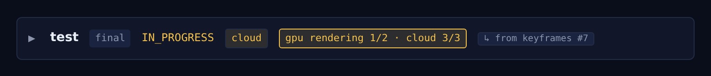
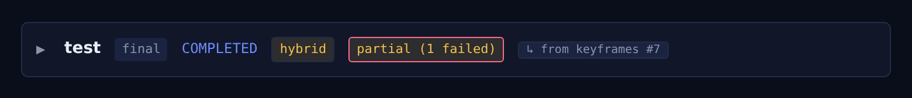

# Hybrid render: live verification checklist

A step-by-step handoff for verifying the GPU+cloud **hybrid** i2v path end to end.
Workflows and Containers do **not** run under `wrangler dev`, so the hybrid
animator can only be validated against a deployed worker with a live RunPod
endpoint. One well-constructed hybrid render exercises everything shipped since
the last live run:

- **v0.153.0** GPU-lane keyframe parity (`overlayKeyframesIntoBundle`) -- deployed
  but never live-run; the overlaid-bundle -> finalize path is the new mechanic.
- **v0.154.0** slice-3 polish: dual-lane progress, beat-sync trim on both lanes,
  continue-on-error partial success, cost hint.

Design refs: [`i2v-backend-selector.md`](./i2v-backend-selector.md),
[`i2v-hybrid-backend.md`](./i2v-hybrid-backend.md).

## Prerequisites

- The worker is deployed at `main` >= v0.154.0 (Jenkins auto-deploys `main`).
- A project with an **anime** cast. (Seedance hard-blocks photoreal real-person
  keyframes; anime passes cloud moderation. Runway has a loosenable threshold,
  but keep it simple and stay anime.)
- A music bed -- **generate a song with the built-in music generator** (chat
  playground, e.g. MiniMax Music) and download it. The SAME song is used twice
  (beat-sync source + final mux), so the beat-trimmed cuts land on its beats.

## Why the song matters

The beat-sync trim (#4) only does anything when the storyboard carries per-scene
`target_seconds`. Those are stamped by `applyBeatTiming` when you beat-sync the
plan. **Beat-sync BEFORE you bundle**, so the bundle's `storyboard.yaml` (which is
what the hybrid assembler reads for the cloud lane) actually contains the
durations. No beat-sync -> no `target_seconds` -> the trim is a silent no-op and
clips keep their native ~5s length (you would not be testing #4).

## Setup (one short film)

Keep it small to save GPU minutes: **~4 shots, 2 GPU + 2 cloud** is enough.

1. **Plan + beat-sync.** Plan the film, upload the generated song, run analyze, and
   re-plan/refine so each scene gets a beat-aligned `target_seconds`. Confirm the
   storyboard now shows per-shot durations.
2. **Bundle** the project (storyboard + cast). The bundle's `storyboard.yaml` now
   carries the beat durations.
3. **Render a keyframes-only PREVIEW** (not a full render): SDXL stills only, fast.
   Wait for it to reach **COMPLETED**. (The preview row must have a `bundle_key` --
   keyframes-only previews do.)
4. **Animate as Hybrid.** Expand the completed preview, set **Motion =
   "Hybrid (per-shot GPU/Cloud)"**, then per shot:
   - 2 shots -> **two different cloud models** (e.g. Seedance 2.0 Fast and
     Hailuo 2.3) -- this also re-exercises 4a per-shot mixing.
   - 2 shots -> leave **(default)** = GPU Wan.
   - The confirm dialog shows the shot split + the cost hint. Submit.

## What to watch DURING the run

The cloud lane runs **first** (minutes), then the GPU long pole (~20-30 min). In
History, the in-flight row should show the **dual-lane** badge updating, e.g.:

`animating` -> `cloud 1/2` -> `cloud 2/2` -> `GPU rendering 1/2 · cloud 2/2` -> ...

- [ ] Cloud lane ticks per shot within the first few minutes.
- [ ] During the GPU wait the badge reflects BOTH lanes (GPU shows `rendering` +
      a rising k/N from the pod render fraction; cloud shows its final m/M).

## What to verify on COMPLETION (the silent `hybrid_full.mp4`)

- [ ] **v0.153.0 parity:** each **GPU** shot's FIRST FRAME == that shot's preview
      keyframe (eyeball it). This is the overlay path's first live run. If it
      regressed, the per-render log names the lane; one-commit revert of #36.
- [ ] **v0.154.0 beat-trim (#4):** GPU **and** cloud clip durations match the beat
      `target_seconds` (NOT the cloud models' native ~5s). The cut should feel
      beat-locked, not uniform.
- [ ] **Assembly:** GPU + cloud clips normalized to **1280x720 / 24fps** (no size
      or fps jumps at a lane boundary).
- [ ] **Labels:** the completed row badges **`hybrid`**; `output.clips[].backend`
      is correct per shot.

## Score it (closes the loop + tests the mux container)

The hybrid output is **silent by design**. Use **add audio** with the SAME song:

- [ ] add-audio produces a final MP4 with the song muxed on (`video-finish`).
- [ ] The beat-trimmed cuts land on the song's beats.

## Continue-on-error / partial (#3) -- opportunistic

Hard to trigger deliberately (submit-time validation blocks bad model ids; the
anime cast won't trip moderation), and the DOM + unit tests already cover the
partial path. So treat it as opportunistic:

- [ ] **If** a shot fails on its own, confirm the run still completes and the row
      badges **`partial (N failed)`** with the cut assembled from the survivors;
      `output.failed_shots` names the failed shot(s) (tooltip on the badge).

Do **not** contort the live run to force a failure.

## If something regresses

- The per-render log (History "logs" link) names the failing lane/shot and carries
  the AI Gateway log ids for cloud shots.
- Inspect a stuck workflow:
  `npx wrangler workflows instances describe skyphusion-longrun <jobId>`
- Tail the worker: `npx wrangler tail`.
- The hybrid GPU-lane parity overlay is isolated to PR #36; a one-commit revert
  drops back to the (cloud-lane-correct) pre-overlay behavior.
